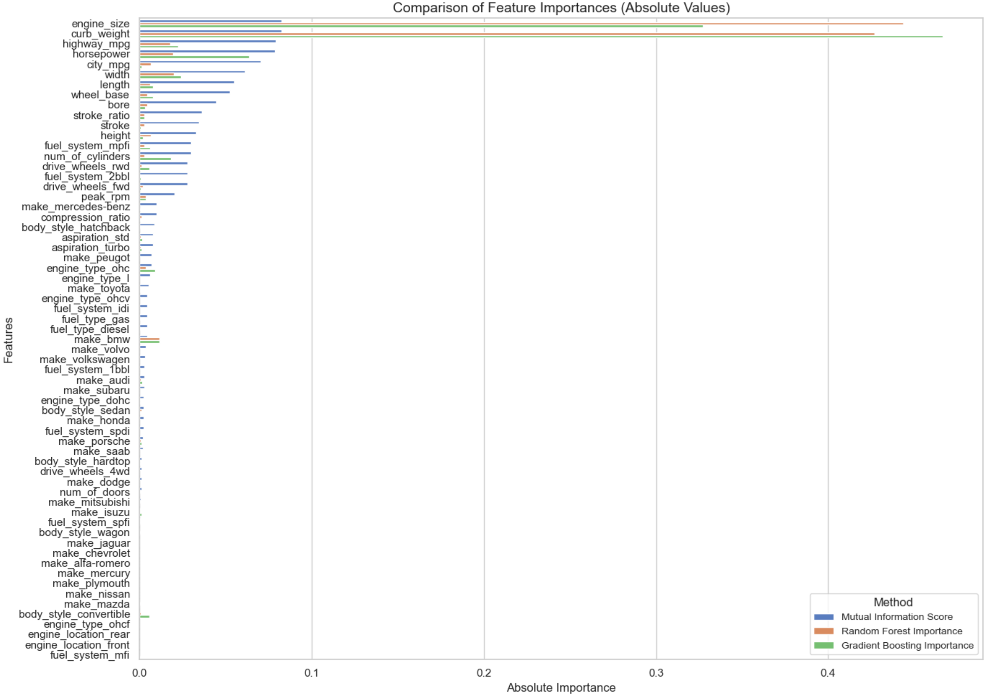

### **Проєкт: Аналіз важливості ознак із використанням Mutual Information, Random Forest та Gradient Boosting**

---

## **Опис проєкту**

Цей домашній проєкт проводить аналіз важливості ознак за допомогою трьох підходів:
1. **Mutual Information** — оцінює зв'язок між ознакою та цільовою змінною.
2. **Random Forest Importance** — враховує нелінійні взаємозалежності ознак.
3. **Gradient Boosting Importance** — надає оцінку важливості ознак у моделі градієнтного бустингу.

Проєкт включає масштабування результатів, ранжування ознак та побудову візуалізацій для кращого розуміння внеску кожної ознаки.

---

## **Використані інструменти та бібліотеки**

- **Python 3.11.4**
- **Pandas** — для обробки та аналізу даних.
- **Matplotlib та Seaborn** — для побудови візуалізацій.
- **Scikit-learn** — для обчислення важливості ознак.
- **Jupyter Notebook** — для проведення аналізу та інтерактивного тестування.

---

## **Дані**

Вхідний файл: **`dataset.pkl`**  
- Датасет містить ознаки, які описують автомобілі, включаючи фізичні та технічні параметри.

---

## **Основні кроки аналізу**

1. **Підготовка даних**:
   - Очистка даних.
   - Збереження ознак у відповідному форматі.

2. **Обчислення важливості ознак**:
   - Застосування **Mutual Information**, **Random Forest**, **Gradient Boosting**.
   - Масштабування значень для уніфікації.

3. **Ранжування ознак**:
   - Використання методу `.rank(pct=True)` для визначення процентильного рангу ознак.

4. **Візуалізація**:
   - Побудова **grouped barplots** для порівняння важливості ознак за методами.
   - Побудова графіків для ранжування ознак.

---

## **Візуалізації**

1. **Порівняння абсолютних значень важливості ознак**:
   

2. **Ранжування ознак за методами**:
   

---

## **Висновки**

1. **Найважливіші ознаки**:
   - `curb_weight`
   - `engine_size`
   - `horsepower`

2. **Менш важливі ознаки**:
   - `fuel_system_mfi`
   - `engine_location_rear`

3. **Відмінності між методами**:
   - Хоча всі методи погоджуються у визначенні топ-ознак, для менш важливих ознак існують певні розбіжності.

---

## **Як запустити проєкт**

1. **Встановіть залежності**:
   ```bash
   pip install pandas matplotlib seaborn scikit-learn
   
2. **Запустіть скрипт:**:
   ```bash
   python dz_topic_10_БабенкоАнтлонІванович.py
   
## Автор
Антон Бабенко

   
   
   
