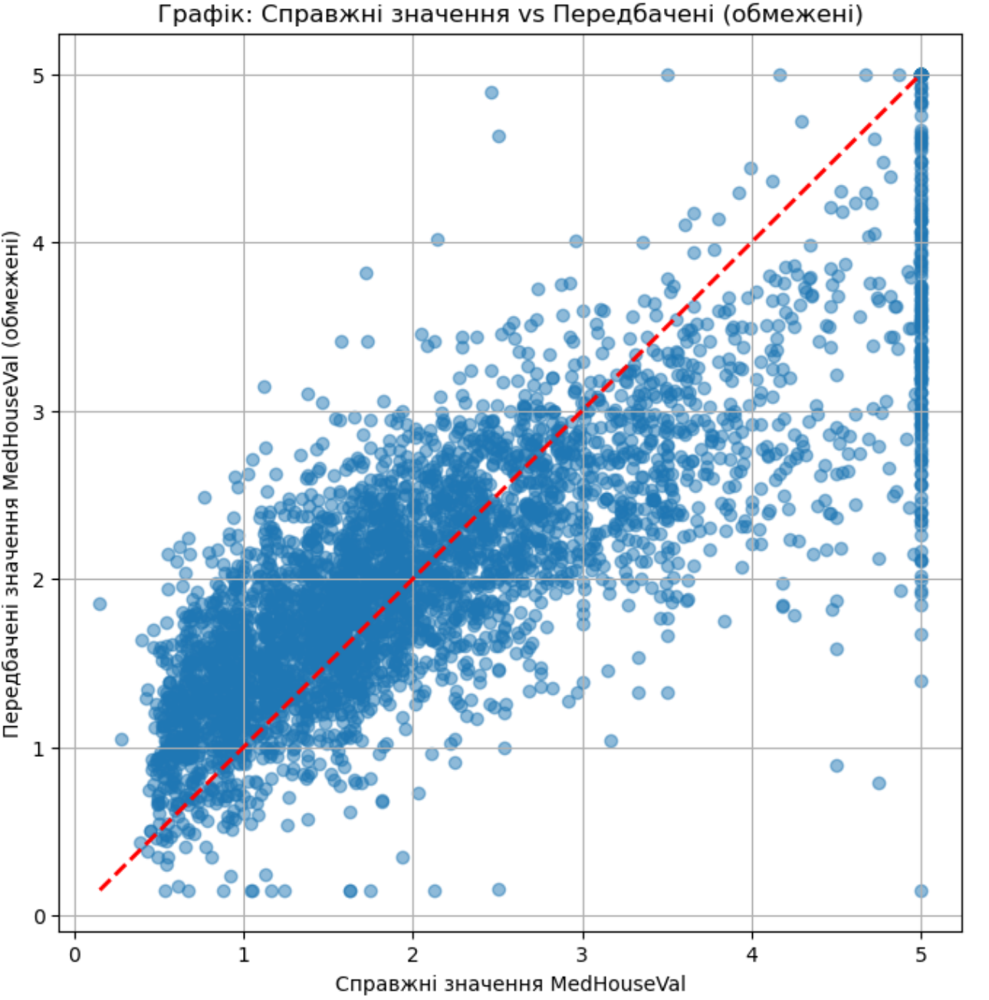
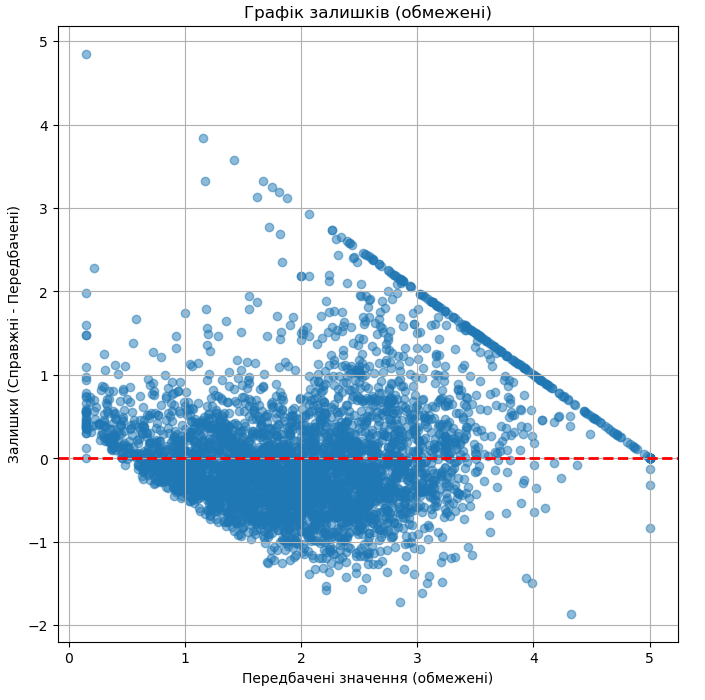

# Домашнє завдання: Лінійна регресія

## Опис проєкту
У цьому проєкті було виконано задачі з побудови лінійної регресії для прогнозування цільової змінної `MedHouseVal` з датасету California Housing. Проєкт включає етапи обробки даних, видалення викидів, видалення високо корельованих ознак, нормалізацію даних та побудову моделі.

---

## Виконані кроки

### 1. Імпорт необхідних пакетів
Здійснено імпорт усіх бібліотек, зокрема `pandas`, `numpy`, `scikit-learn` та інших.

### 2. Завантаження даних
Завантажено датасет California Housing через `fetch_california_housing`.

### 3. Обробка даних
- **Очистка викидів:** Видалено викиди в колонках `AveRooms`, `AveBedrms`, `AveOccup`, `Population` за допомогою методу Z-score.
- **Видалення ознак:** Видалено ознаки `Longitude`, `Latitude` та додаткову найменш суттєву ознаку, базуючись на кореляційній матриці.

### 4. Нормалізація даних
Дані нормалізовані за допомогою `StandardScaler`.

### 5. Побудова моделі
- Використано модель `LinearRegression` для навчання.
- Проведено прогнозування на тестових даних.
- Враховано рекомендацію обмежити передбачені значення в межах [min, max] тренувальних даних.

### 6. Оцінка моделі
Обчислено метрики:
- **R² (тренувальні дані):** 0.58
- **R² (тестові дані):** 0.60
- **MAE:** 0.53
- **MAPE:** 32.74%

---

## Візуалізації
### Графік справжніх значень vs передбачені (обмежені)

### Графік залишків

---

## Висновки
- Модель має помірну точність із поясненням 60% варіації на тестових даних.
- Обмеження передбачень допомогло зменшити "стіновий ефект".
- Показники MAE та MAPE свідчать про наявність похибок, але модель демонструє узагальнення.

---

## Інструкція для запуску
1. Встановіть необхідні пакети з файлу `requirements.txt`.
2. Запустіть ноутбук `dz_topic_4_БабенкоАнтонІванович.ipynb`.
